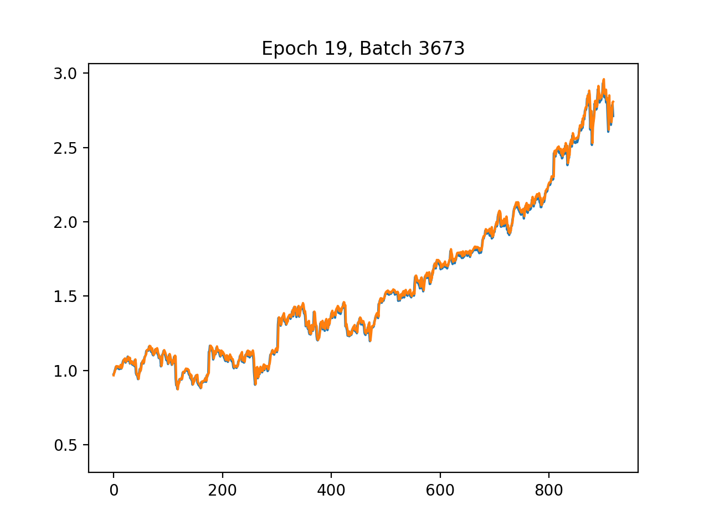

# Stock Prediction [](https://travis-ci.org/UWCESEDUO/stock-prediction)
A complete machine learning data pipeline for training TensorFlow models to forecast stock prices. Written in Python.

Goal: given stock data (`opening`, `closing` and `indicators`), predict next day's `adjusted closing` price

Predictions for MSFT:



Mean Relative error: 11.53%

Orange line: predictions

Blue line: actual

## Running the pipeline
First, make sure dependencies are installed:
```shell
$ pip install -r requirements.txt
```

The pipeline is outlined in `scripts/run.py`. To run the complete pipeline to train a neural network model for each stock (i.e. fetch, preprocess, train, evaluate), run:
```shell
$ python scripts/run.py -f -p -nn
```

### Running jobs separately
`-f`, `--fetch`: run the data fetch job, which fetches stock data and financial indicators for each stock symbol, joins them together, then saves the data to a `csv` file in `output/raw`

`-p`, `--preprocess`: run the preprocessing job. Data must already exist in `output/raw`. This job creates the label dimension and shifts it one day down. It then splits the data into 80% training and 20% testing sets. After that, a *last observed carried forward* procedure is performed to fill in the missing data. Finally, a `scikit-learn` `MinMaxScaler` is applied to each column to scale the dataset.

`-nn`, `--neuralnetwork`: trains a neural network model for each stock using TensorFlow. Then runs a simply evaluation on the test set to calculate the relative error. Models are saved in `output/models`

`--evalnn`: runs evaluation using the test data set. Gives MSE and relative error.

## Pipeline
The pipeline consists of the following stages
1. Data fetching from [AlphaVantage stock quotes API](http://alphavantage.co)
2. Data preprocessing - splitting, scaling/normalization, last observed carried forward and shifting
3. Training various supervised learning models, a separate model is trained for each stock
	- Neural Networks
	- AdaBoost regressors
	- Gradient boosting regressors
	- Random forest regressors
4. Model evaluation - loss and relative error

## Structure of data
the stock data for S&P 500 companies includes the `daily adjusted time series` data as well as 51 financial indicators. The `adjusted closing` is used as the label and shifted one day down.

## Models used
**Neural Networks**

A TensorFlow 5 layer Neural Network is used. The 3 hidden layers have 64, 32 and 16 neurons respectively to better fit the input dimensions. `Rectified Linear Units` are used as activation functions. The `Mean Squared Error` is used as the loss function and the `AdamOptimizer` is used to compute the gradients.

**Boosting Regressor**

**Random Forest Regressor**

## Future Improvements
- Sentiment analysis on Twitter and news
